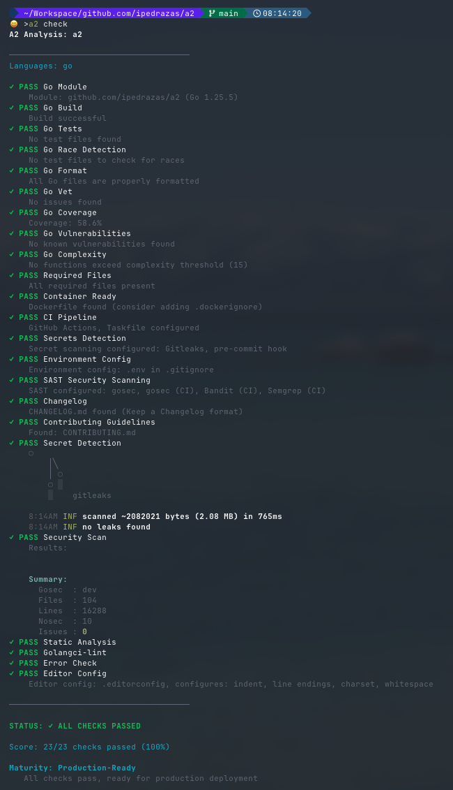

# a2 - (AI) Application Analysis 

By far, the biggest complain I've heard recently is about fighting the AI Slop fight. This is my approach of trying to deal with precissely "too much code" and then, how to know if that code is any good. 

The main issue of trying to **review vibecode applications** is that, well, they might be very different from each other, but that doesn't mean is bad. Quality is a series of conventions and routines that we follow to help keeping our applications above certain baseline.

It might be that the AI Slop application that you have inherited is a hot mess, but AI Generated applications can conform to your standards if you know how to prompt the Coding Agent. `a2` provides a deterministic way of keeping your coding agent above that baseline (whatever it is).

My approach is the following: I don't know in which shape this application is, but I'm going to run `a2` and it's going to check if there are tests, and if they pass. If I think that 50% coverage is good, it will check for that as well, it will scan for secrets, and other security analysis that we forget to run most of the times... because as I said, I might not know the shape of the app, but if `a2` returns a bunch of `✓ PASS`, at least I know it matches what I consider good.

I know, it's not perfect, but it's fast. You go to your coding agent and just tell them to do what I have in my [slash command](.claude/commands/a2.md), and see how that AI slop, is turned into a well-shaped AI Slop 🙈.

```
run `a2 check -f toon` and fix all the reported issues
```
If you run this for the first time, you might want to tell the agent to write an execution plan to a file and use it to track progress. In particular if you have very few tests (or even zero).

There are 3 formats: text (for humans), JSON (for CI), toon (for Coding Agents). The other thing you might need is to install a set of tools to run the checks, but `a2 doctor` will help you with that.

## a2 Checks

`a2` is built on checks (or tests), that succed or fail, to give you a quick overview of the application. You can define your own checks, because it's not about the application, but about your expectations with the application. 

The idea is very simple: clone a repo, run `a2 check` get an idea of what and what not (documentation, tests, obserrvability, healthchecks, migration, security scan...) matches with your baseline expectation and decide if you want the agent to deal with it.

I have a `Claude Code` slash command `a2` that basically does that. You can take a look to it [here](.claude/commands/a2.md).

A2 auto-detects project language(s), runs a suite of checks, and provides a health score with recommendations that you can give to your Coding Agent to improve your application. Because that was the other thing. I use Coding Agents, so, I wanted a tool that I could use to give to the Agents to make my application meet my expectations. That's why we have `profiles` (api, lib, desktop...), and `targets` (PoC, Dev, Production), because every application has different expectations, I don't need all my side projects to be production-ready. But I want an easy way to get there if needed (or stay in line).

It's up to you to decide which checks make sense for you and your project. `a2` allows you to configure what and what not to run. For example, if you run `a2 check` in this repo, you will get a response like this one:

For example, this repo uses `a2` to stay on track:, if you run `a2 check`, you will get something like this:



Checks are defined in [.a2.yaml](.a2.yaml) in case you're curious.

As you can see `a2` will tell you the maturity level of the project based on the results of the checks. While it's true that you could use `Claude Code` or any other coding agent to do the same, I'd rather use a deterministic approach because saying that something is "Production-ready" depends on what you consider what production level is.

This tool does not replace your coding agent, it complements it. What you do with `a2` is delegate a set of expectations to a series of `Checks` (or tests), you can look at the different tests in [docs/CHECKS.md](docs/CHECKS.md). Your coding agent and you are in charge of implementing telemetry, `a2` only checks if you have it or not.

## Features

- **8 Languages Supported**: Go, Python, Node.js, TypeScript, Java, Rust, Swift (auto-detected or explicit)
- **80+ Built-in Checks**: Build, tests, coverage, formatting, linting, type checking, vulnerabilities, and more
- **Application Profiles**: CLI, API, Library, Desktop - tailor checks to your app type
- **Maturity Targets**: PoC or Production - control check strictness
- **Maturity Assessment**: Automatic scoring with Production-Ready, Mature, Development, or PoC levels
- **Veto System**: Critical checks (build, tests) stop execution on failure
- **Pretty Output**: Colored terminal output with recommendations
- **JSON & TOON Output**: Machine-readable formats for CI/CD and coding agents
- **Configurable**: `.a2.yaml` for thresholds, disabled checks, and custom checks
- **Config Generator**: Interactive or CLI-based `.a2.yaml` generation with `a2 add`
- **Extensible**: Add your own checks via external binaries
- **CI/CD Ready**: GitHub Action and pre-commit hook support

You can run `a2` in CI if you want to, the original idea was not that but I found it's much easier to have the same validation in local dev than CI.

## Installation

```bash
go install github.com/ipedrazas/a2@latest
```

## Usage

```bash
# Run checks on current directory (auto-detects language)
a2 check

# Run checks on specific path
a2 check /path/to/project

# Explicit language selection
a2 check --lang python
a2 check --lang go,python

# Use application profile
a2 check --profile=cli      # Command-line tool
a2 check --profile=api      # Web service/API
a2 check --profile=library  # Reusable package
a2 check --profile=desktop  # Desktop application

# Use maturity target
a2 check --target=poc       # Minimal checks for early development
a2 check --target=production # All checks (default)

# Combine profile and target
a2 check --profile=cli --target=poc

# JSON output for CI/CD
a2 check --format json

# TOON output for coding agents (minimal token usage)
a2 check --format toon

# Skip specific checks
a2 check --skip=license,k8s

# List available options
a2 list checks  # List all available checks with IDs
a2 profiles     # List application profiles
a2 targets      # List maturity targets

# Check system for required tools
a2 doctor       # Show installed/missing tools for detected languages
a2 doctor --all # Show tools for all languages
```

## Generating Configuration

Use `a2 add` to generate a `.a2.yaml` configuration file. Two modes are available:

### Interactive Mode

Run with `-i` flag for guided prompts:

```bash
a2 add -i
```

This will prompt you for:
1. **Application profile** (cli, api, library, desktop)
2. **Maturity target** (poc, production)
3. **Languages** (auto-detected, with option to modify)
4. **Required files** (README.md, LICENSE, etc.)
5. **Coverage threshold** (default: 80%)

Shows a preview before writing the file.

### Non-Interactive Mode

Pass options directly via flags:

```bash
# Basic usage
a2 add --profile cli --target poc

# With language and coverage
a2 add --lang go,python --coverage 90

# Custom required files
a2 add --files README.md,LICENSE,CHANGELOG.md

# Overwrite existing config
a2 add --profile api --force

# Custom output path
a2 add --output custom-config.yaml
```

### Available Flags

| Flag | Description | Default |
|------|-------------|---------|
| `-i, --interactive` | Run in interactive mode | `false` |
| `--profile` | Application profile (cli, api, library, desktop) | - |
| `--target` | Maturity target (poc, production) | - |
| `--lang` | Languages (go, python, node, java, rust, typescript, swift) | auto-detect |
| `--files` | Required files (comma-separated) | README.md,LICENSE |
| `--coverage` | Coverage threshold (0-100) | 80 |
| `-o, --output` | Output file path | .a2.yaml |
| `-f, --force` | Overwrite existing file | `false` |

## Application Profiles

Profiles define which checks are relevant for your application type. Use `--profile` to select one:

| Profile | Description | Skipped Checks |
|---------|-------------|----------------|
| `cli` | Command-line tools | health, k8s, metrics, api_docs, integration, shutdown, errors, e2e, tracing |
| `api` | Web services/APIs | e2e (uses integration tests instead) |
| `library` | Reusable packages | dockerfile, health, k8s, shutdown, metrics, errors, integration, tracing, e2e, api_docs |
| `desktop` | Desktop applications | health, k8s, api_docs, tracing, metrics, shutdown |

```bash
# List all profiles with details
a2 profiles
```

## Maturity Targets

Targets control the strictness level of checks based on your project stage. Use `--target` to select one:

| Target | Description | Effect |
|--------|-------------|--------|
| `poc` | Proof of Concept | Skips non-critical checks (license, sast, coverage, deps, etc.) |
| `production` | Production-ready (default) | All checks enabled |

```bash
# List all targets with details
a2 targets

# Combine with profiles
a2 check --profile=api --target=poc  # API in early development
```

## Maturity Assessment

A2 automatically assesses your project's maturity level based on check results:

| Level | Criteria |
|-------|----------|
| **Production-Ready** | 100% score, 0 failures, 0 warnings |
| **Mature** | ≥80% score, 0 failures |
| **Development** | ≥60% score, ≤2 failures |
| **Proof of Concept** | <60% score or >2 failures |

## Supported Languages

A2 supports 8 programming languages with auto-detection:

| Language | Indicator Files | Checks |
|----------|-----------------|--------|
| **Go** | `go.mod`, `go.sum` | 10 checks |
| **Python** | `pyproject.toml`, `setup.py`, `requirements.txt`, `Pipfile` | 10 checks |
| **Node.js** | `package.json`, `package-lock.json`, `yarn.lock`, `pnpm-lock.yaml` | 9 checks |
| **TypeScript** | `tsconfig.json` | 9 checks |
| **Java** | `pom.xml`, `build.gradle`, `build.gradle.kts` | 8 checks |
| **Rust** | `Cargo.toml` | 8 checks |
| **Swift** | `Package.swift`, `Package.resolved` | 8 checks |

Use `--lang` flag or `language.explicit` config to override auto-detection.

## Built-in Checks

### Go Checks (10)

| Check | ID | Severity | Description |
|-------|-----|----------|-------------|
| Go Module | `go:module` | Fail | go.mod exists and has valid Go version |
| Go Build | `go:build` | Fail | `go build ./...` succeeds |
| Go Tests | `go:tests` | Fail | `go test ./...` passes |
| Go Race Detection | `go:race` | Warn | No data races (`go test -race`) |
| Go Format | `go:format` | Warn | Code is properly formatted (`gofmt`) |
| Go Vet | `go:vet` | Warn | No `go vet` issues |
| Go Coverage | `go:coverage` | Warn | Coverage >= threshold (default 80%) |
| Go Vulnerabilities | `go:deps` | Warn | No known vulns (`govulncheck`) |
| Go Complexity | `go:cyclomatic` | Warn | No functions exceed complexity threshold |
| Go Logging | `go:logging` | Warn | Uses structured logging library |

### Python Checks (10)

| Check | ID | Severity | Description |
|-------|-----|----------|-------------|
| Python Project | `python:project` | Fail | pyproject.toml or setup.py exists |
| Python Build | `python:build` | Fail | Dependencies install successfully |
| Python Tests | `python:tests` | Fail | pytest or unittest passes |
| Python Format | `python:format` | Warn | Code formatted (black/ruff) |
| Python Lint | `python:lint` | Warn | No lint issues (ruff/flake8/pylint) |
| Python Type Check | `python:type` | Warn | No type errors (mypy/pyright) |
| Python Coverage | `python:coverage` | Warn | Coverage >= threshold (default 80%) |
| Python Vulnerabilities | `python:deps` | Warn | No known vulns (pip-audit/safety) |
| Python Complexity | `python:complexity` | Warn | No functions exceed complexity threshold |
| Python Logging | `python:logging` | Warn | Uses logging library, not print() |

### Node.js Checks (9)

| Check | ID | Severity | Description |
|-------|-----|----------|-------------|
| Node Project | `node:project` | Fail | package.json exists with name/version |
| Node Build | `node:build` | Fail | Dependencies install successfully |
| Node Tests | `node:tests` | Fail | Tests pass (jest/vitest/mocha) |
| Node Format | `node:format` | Warn | Code formatted (prettier/biome) |
| Node Lint | `node:lint` | Warn | No lint issues (eslint/biome/oxlint) |
| Node Type Check | `node:type` | Warn | No type errors (tsc --noEmit) |
| Node Coverage | `node:coverage` | Warn | Coverage >= threshold (default 80%) |
| Node Vulnerabilities | `node:deps` | Warn | No known vulns (npm/yarn/pnpm audit) |
| Node Logging | `node:logging` | Warn | Uses logging library, warns on console.log |

### TypeScript Checks (9)

| Check | ID | Severity | Description |
|-------|-----|----------|-------------|
| TypeScript Project | `typescript:project` | Fail | tsconfig.json exists |
| TypeScript Build | `typescript:build` | Fail | Build script or `tsc --noEmit` succeeds |
| TypeScript Tests | `typescript:tests` | Fail | Tests pass (jest/vitest/mocha) |
| TypeScript Format | `typescript:format` | Warn | Code formatted (prettier/biome/dprint) |
| TypeScript Lint | `typescript:lint` | Warn | No lint issues (eslint/biome/oxlint) |
| TypeScript Type Check | `typescript:type` | Fail | No type errors (`tsc --noEmit`) |
| TypeScript Coverage | `typescript:coverage` | Warn | Coverage tools configured |
| TypeScript Vulnerabilities | `typescript:deps` | Warn | No known vulns (npm/yarn/pnpm audit) |
| TypeScript Logging | `typescript:logging` | Warn | Uses logging library (winston/pino/tslog) |

### Java Checks (8)

| Check | ID | Severity | Description |
|-------|-----|----------|-------------|
| Java Project | `java:project` | Fail | pom.xml or build.gradle exists |
| Java Build | `java:build` | Fail | Maven/Gradle build succeeds |
| Java Tests | `java:tests` | Fail | JUnit/TestNG tests pass |
| Java Format | `java:format` | Warn | Formatter configured (Spotless/google-java-format) |
| Java Lint | `java:lint` | Warn | Linter configured (Checkstyle/SpotBugs/PMD) |
| Java Coverage | `java:coverage` | Warn | JaCoCo coverage >= threshold |
| Java Vulnerabilities | `java:deps` | Warn | Dependency scanning configured |
| Java Logging | `java:logging` | Warn | Uses SLF4J/Logback/Log4j2, not System.out |

### Rust Checks (8)

| Check | ID | Severity | Description |
|-------|-----|----------|-------------|
| Rust Project | `rust:project` | Fail | Cargo.toml exists |
| Rust Build | `rust:build` | Fail | `cargo check` succeeds |
| Rust Tests | `rust:tests` | Fail | `cargo test` passes |
| Rust Format | `rust:format` | Warn | Code formatted (`cargo fmt --check`) |
| Rust Lint | `rust:lint` | Warn | No Clippy warnings (`cargo clippy`) |
| Rust Coverage | `rust:coverage` | Warn | Coverage tools configured (tarpaulin/llvm-cov) |
| Rust Vulnerabilities | `rust:deps` | Warn | No known vulns (`cargo audit`) |
| Rust Logging | `rust:logging` | Warn | Uses tracing/log crate, not println! |

### Swift Checks (8)

| Check | ID | Severity | Description |
|-------|-----|----------|-------------|
| Swift Project | `swift:project` | Fail | Package.swift exists |
| Swift Build | `swift:build` | Fail | `swift build` succeeds |
| Swift Tests | `swift:tests` | Fail | `swift test` passes |
| Swift Format | `swift:format` | Warn | Code formatted (swift-format/SwiftLint) |
| Swift Lint | `swift:lint` | Warn | No SwiftLint warnings |
| Swift Coverage | `swift:coverage` | Warn | Coverage tools configured (llvm-cov) |
| Swift Vulnerabilities | `swift:deps` | Warn | Dependency scanning configured |
| Swift Logging | `swift:logging` | Warn | Uses OSLog/swift-log, not print() |

### Common Checks (23)

These checks apply to all projects regardless of language:

| Check | ID | Severity | Description |
|-------|-----|----------|-------------|
| Required Files | `file_exists` | Warn | README.md, LICENSE exist |
| Dockerfile | `common:dockerfile` | Warn | Container configuration present |
| CI Pipeline | `common:ci` | Warn | CI/CD configuration present |
| Health Check | `common:health` | Warn | Health endpoint configured |
| Kubernetes | `common:k8s` | Warn | K8s manifests, Helm, or Kustomize |
| Pre-commit Hooks | `common:precommit` | Warn | Git hooks configured |
| Changelog | `common:changelog` | Warn | CHANGELOG.md present |
| Secrets Detection | `common:secrets` | Warn | Secret scanning configured |
| Environment Config | `common:env` | Warn | .env handling configured |
| License Compliance | `common:license` | Warn | License scanning configured |
| SAST | `common:sast` | Warn | Static analysis security testing |
| API Documentation | `common:api_docs` | Warn | OpenAPI/Swagger docs present |
| Integration Tests | `common:integration` | Warn | Integration test infrastructure |
| Metrics | `common:metrics` | Warn | Prometheus/OpenTelemetry metrics |
| Error Tracking | `common:errors` | Warn | Sentry/Rollbar/Bugsnag configured |
| Graceful Shutdown | `common:shutdown` | Warn | Signal handling implemented |
| Contributing | `common:contributing` | Warn | CONTRIBUTING.md, PR/issue templates |
| E2E Tests | `common:e2e` | Warn | Cypress/Playwright/Selenium configured |
| Distributed Tracing | `common:tracing` | Warn | OpenTelemetry/Jaeger/Datadog |
| Database Migrations | `common:migrations` | Warn | Migration tool configured |
| Config Validation | `common:config_validation` | Warn | Config validation library used |
| Retry Logic | `common:retry` | Warn | Retry/resilience library used |
| Editor Config | `common:editorconfig` | Warn | .editorconfig present |

> **See [docs/CHECKS.md](docs/CHECKS.md) for detailed documentation** on all checks, including configuration options, auto-detection logic, and pass/warn/fail conditions.

**Severity Levels:**
- **Fail**: Critical check - stops execution immediately (veto power)
- **Warn**: Non-critical - reported but doesn't stop execution
- **Pass**: Check passed

## Configuration

Create a `.a2.yaml` file in your project root.

### Example: Go Project

```yaml
# Language settings
language:
  go:
    coverage_threshold: 80

# Required files to check
files:
  required:
    - README.md
    - LICENSE
    - CONTRIBUTING.md

# Disable specific checks
checks:
  disabled:
    - go:deps  # Skip vulnerability check

# Execution options
execution:
  parallel: true  # Run checks concurrently (default)

# Custom external checks
external:
  - id: lint
    name: Golangci-lint
    command: golangci-lint
    args: ["run", "./..."]
    severity: warn

  - id: security
    name: Security Scan
    command: gosec
    args: ["./..."]
    severity: fail
```

### Example: Python Project

```yaml
language:
  python:
    package_manager: auto  # auto, pip, poetry, pipenv
    test_runner: auto      # auto, pytest, unittest
    formatter: auto        # auto, black, ruff
    linter: auto           # auto, ruff, flake8, pylint
    coverage_threshold: 75

files:
  required:
    - README.md
    - LICENSE
    - pyproject.toml

checks:
  disabled:
    - python:deps

external:
  - id: security
    name: Security Scan
    command: bandit
    args: ["-r", "src/"]
    severity: warn
```

### Example: Node.js/TypeScript Project

```yaml
language:
  node:
    package_manager: auto  # auto, npm, yarn, pnpm, bun
    test_runner: auto      # auto, jest, vitest, mocha
    formatter: auto        # auto, prettier, biome
    linter: auto           # auto, eslint, biome, oxlint
    coverage_threshold: 80
  typescript:
    coverage_threshold: 80

files:
  required:
    - README.md
    - LICENSE
    - package.json

checks:
  disabled:
    - node:deps
```

### Multi-Language Project (Monorepo)

```yaml
# Explicit language selection (overrides auto-detect)
language:
  explicit:
    - go
    - python
    - typescript
  go:
    coverage_threshold: 80
  python:
    coverage_threshold: 70
    linter: ruff
  typescript:
    coverage_threshold: 75

files:
  required:
    - README.md
```

## External Checks

A2 supports external check binaries. The protocol is simple:

- **Exit code 0**: Pass
- **Exit code 1**: Warning
- **Exit code 2+**: Fail

Output can be plain text or JSON:

```json
{
  "message": "Found 3 issues",
  "status": "warn"
}
```

## GitHub Action

```yaml
name: A2 Analysis
on: [push, pull_request]

jobs:
  a2:
    runs-on: ubuntu-latest
    steps:
      - uses: actions/checkout@v4

      - name: Run A2
        uses: ipedrazas/a2@v1
        with:
          path: '.'
          format: 'pretty'
          profile: 'api'
          target: 'production'
          fail-on-warning: 'false'
```

### Inputs

| Input | Description | Default |
|-------|-------------|---------|
| `path` | Directory to analyze | `.` |
| `format` | Output format (pretty/json) | `pretty` |
| `profile` | Application profile (cli/api/library/desktop) | - |
| `target` | Maturity target (poc/production) | `production` |
| `fail-on-warning` | Fail if warnings exist | `false` |

### Outputs

| Output | Description |
|--------|-------------|
| `score` | Percentage of checks passed |
| `passed` | Number of passed checks |
| `total` | Total checks run |
| `success` | Whether critical checks passed |
| `maturity` | Maturity level assessment |

## Pre-commit Hook

Add to `.pre-commit-config.yaml`:

```yaml
repos:
  - repo: https://github.com/ipedrazas/a2
    rev: v1.0.0
    hooks:
      - id: a2
        args: ['--profile=library']  # Optional: specify profile
```

## Docker

```bash
# Run checks
docker run -v $(pwd):/workspace ipedrazas/a2 check

# Run with profile
docker run -v $(pwd):/workspace ipedrazas/a2 check --profile=api
```

## Exit Codes

- `0`: All checks passed (warnings allowed)
- `1`: One or more critical checks failed

## License

MIT License - see [LICENSE](LICENSE)

