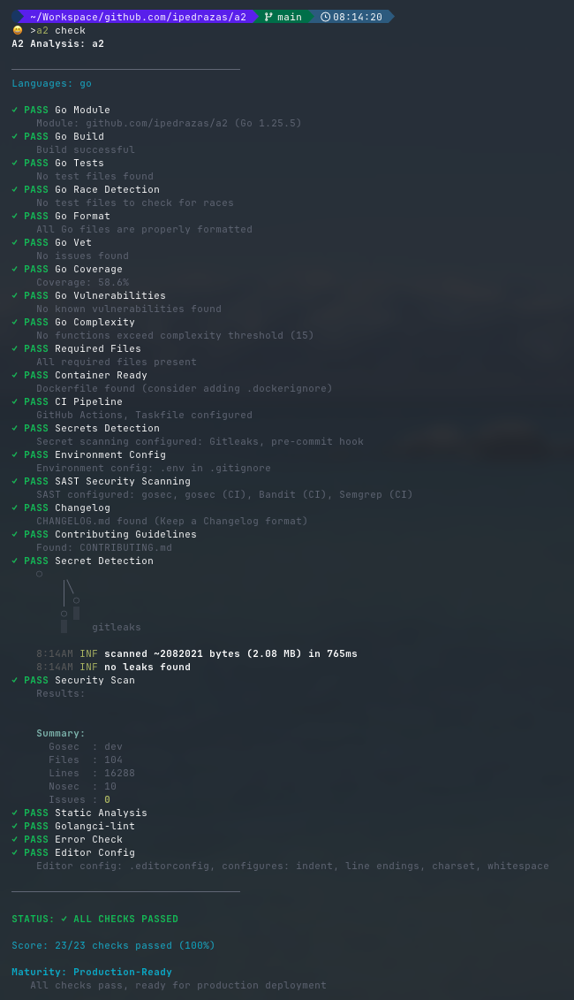

# a2 - Application Analysis

Deterministic code quality checks for any repository. Run 80+ checks across 8 languages, get a pass/fail health score, and feed the results to your coding agent to fix issues automatically.

## Why a2?

- **Clone a repo, run `a2 check`, instantly know if it meets your baseline** - tests, coverage, security, formatting, and more
- **Deterministic** - same checks, same results, no LLM ambiguity
- **Feed results to coding agents** (Claude Code, Cursor, etc.) to auto-fix issues: `a2 check -f toon`
- **Configurable profiles and targets** for different app types (API, CLI, library) and maturity levels (PoC, production)

## Quick Start

```bash
go install github.com/ipedrazas/a2@latest

a2 check                      # Run all checks (auto-detects language)
a2 check --profile=api        # Tailor checks for an API
a2 check -f toon              # Output for coding agents
```



## Features

- **8 Languages Supported**: Go, Python, Node.js, TypeScript, Java, Rust, Swift (auto-detected or explicit)
- **80+ Built-in Checks**: Build, tests, coverage, formatting, linting, type checking, vulnerabilities, and more
- **Application Profiles**: CLI, API, Library, Desktop - tailor checks to your app type
- **Maturity Targets**: PoC or Production - control check strictness
- **Maturity Assessment**: Automatic scoring with Production-Ready, Mature, Development, or PoC levels
- **Veto System**: Critical checks (build, tests) stop execution on failure
- **Pretty Output**: Colored terminal output with recommendations
- **Verbose Mode**: `-v` shows output for failures, `-vv` shows output for all checks
- **JSON & TOON Output**: Machine-readable formats for CI/CD and coding agents
- **Configurable**: `.a2.yaml` for thresholds, disabled checks, and custom checks
- **Config Generator**: Interactive or CLI-based `.a2.yaml` generation with `a2 add`
- **Extensible**: Add your own checks via external binaries
- **CI/CD Ready**: GitHub Action and pre-commit hook support

## Usage

### Basic

```bash
a2 check                          # Auto-detect language, run all checks
a2 check /path/to/project         # Check specific path
a2 check --lang python            # Explicit language
a2 check --lang go,python         # Multiple languages
```

### Profiles & Targets

```bash
a2 check --profile=api            # Web service/API
a2 check --profile=cli            # Command-line tool
a2 check --profile=library        # Reusable package
a2 check --target=poc             # Minimal checks for early development
a2 check --profile=cli --target=poc  # Combine both
```

### Output Formats

```bash
a2 check                          # Pretty terminal output (default)
a2 check -f json                  # JSON for CI/CD
a2 check -f toon                  # Minimal tokens for coding agents
a2 check -v                       # Verbose (show failed check output)
a2 check -vv                      # Very verbose (show all check output)
```

### Skipping Checks

```bash
a2 check --skip=license,k8s       # Skip specific checks
a2 check --skip="*:tests"         # Skip all test checks (wildcard)
a2 check --skip="node:*"          # Skip all Node.js checks
```

### Exploring & Debugging

```bash
a2 list checks                    # List all available checks
a2 list checks --explain          # List with descriptions
a2 run go:race                    # Run a single check with full output
a2 explain go:race                # Show what a check does
a2 doctor                         # Check for required tools
```

See `a2 --help` for all options.

## Profiles

Profiles define which checks are relevant for your application type:

| Profile | Description | Skipped Checks |
|---------|-------------|----------------|
| `cli` | Command-line tools | health, k8s, metrics, api_docs, integration, shutdown, errors, e2e, tracing |
| `api` | Web services/APIs | e2e (uses integration tests instead) |
| `library` | Reusable packages | dockerfile, health, k8s, shutdown, metrics, errors, integration, tracing, e2e, api_docs |
| `desktop` | Desktop applications | health, k8s, api_docs, tracing, metrics, shutdown |

## Targets

Targets control check strictness based on project stage:

| Target | Description | Effect |
|--------|-------------|--------|
| `poc` | Proof of Concept | Skips non-critical checks (license, sast, coverage, deps, etc.) |
| `production` | Production-ready (default) | All checks enabled |

## Maturity Assessment

A2 automatically assesses your project's maturity level based on check results:

| Level | Criteria |
|-------|----------|
| **Production-Ready** | 100% score, 0 failures, 0 warnings |
| **Mature** | >=80% score, 0 failures |
| **Development** | >=60% score, <=2 failures |
| **Proof of Concept** | <60% score or >2 failures |

## Checks

A2 auto-detects project languages and runs the appropriate checks:

| Language | Checks | Examples |
|----------|--------|----------|
| Go | 10 | build, tests, race detection, coverage, vet, vulnerabilities |
| Python | 10 | build, tests, format, lint, type check, coverage, vulnerabilities |
| Node.js | 9 | build, tests, format, lint, type check, coverage, vulnerabilities |
| TypeScript | 9 | build, tests, format, lint, type check, coverage, vulnerabilities |
| Java | 8 | build, tests, format, lint, coverage, vulnerabilities |
| Rust | 8 | build, tests, format, clippy, coverage, vulnerabilities |
| Swift | 8 | build, tests, format, lint, coverage, vulnerabilities |
| Common | 23 | dockerfile, CI, health, k8s, secrets, SAST, migrations, and more |

See [docs/CHECKS.md](docs/CHECKS.md) for the full check reference with IDs, severity levels, and descriptions.

**Severity levels:** Fail (critical, stops execution) | Warn (reported, doesn't stop) | Pass | Info (no score impact)

## Configuration

Create a `.a2.yaml` file in your project root, or generate one with `a2 add -i`:

```yaml
language:
  go:
    coverage_threshold: 80

files:
  required:
    - README.md
    - LICENSE

checks:
  disabled:
    - go:deps
    - "*:logging"

external:
  - id: lint
    command: golangci-lint
    args: ["run", "./..."]
    severity: warn
```

See [docs/CONFIGURATION.md](docs/CONFIGURATION.md) for the full configuration reference, including multi-language setups, wildcard patterns, and external check protocol.

## Server Mode

A2 can run as a web server with an HTTP API and React UI for on-demand analysis:

```bash
a2 server                         # Start on :8080
a2 server --port 3000             # Custom port
```

Submit checks via API:

```bash
curl -X POST http://localhost:8080/api/check \
  -H "Content-Type: application/json" \
  -d '{"url": "https://github.com/user/repo", "profile": "api"}'
```

See [docs/SERVER.md](docs/SERVER.md) for full server options, API endpoints, and Web UI details.

## CI/CD

### GitHub Action

```yaml
name: A2 Analysis
on: [push, pull_request]

jobs:
  a2:
    runs-on: ubuntu-latest
    steps:
      - uses: actions/checkout@v4
      - name: Run A2
        uses: ipedrazas/a2@v1
        with:
          format: 'pretty'
          profile: 'api'
```

### Docker

```bash
docker run -v $(pwd):/workspace ipedrazas/a2 check
docker run -v $(pwd):/workspace ipedrazas/a2 check --profile=api
```

### Pre-commit Hook

```yaml
repos:
  - repo: https://github.com/ipedrazas/a2
    rev: v1.0.0
    hooks:
      - id: a2
        args: ['--profile=library']
```

## Exit Codes

- `0`: All checks passed (warnings allowed)
- `1`: One or more critical checks failed

## License

MIT License - see [LICENSE](LICENSE)
